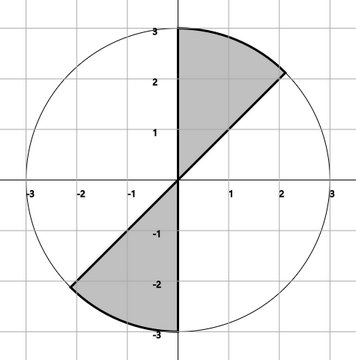

= Лабораторна робота №3 - Розгалуження

:icons: font

*Мета роботи*: отримання практичних навичок з розробки програм, що реалізують алгоритми з розгалуженням.

До цього ми розглядали ситуації, коли обчислення результату функцій відбувалося без розгляду варіантів.
Це можливий, але порівняно рідкісний випадок в програмуванні.
Існує дуже багато завдань, де доводиться розглядати різні варіанти,
і для цієї мети у мовах програмування існують конструкції __розгалуження__.

== Максимум з двох

У якості простого прикладу розглянемо функцію, результат якої дорівнює найбільшому з її параметрів.

[source,kotlin]
----
fun max(m: Int, n: Int) = if (m > n) m else n
----

Тут **if..else** -- __оператор__ або __конструкція__ розгалуження, перекладається з англійскої як **якщо..інакше**.
Після ключового слова **if** в дужках іде __умова__ розгалуження `m > n`.
Якщо умова __істинна__, в якості результату використовується вираз одразу за умовою розгалуження, в даному випадку `m`.
Якщо ж умова __хибна__, використовується вираз після ключового слова **else**, в даному випадку `n`.
Конструкцію можна прочитати як "Якщо m > n, (то) m, інакше n".
Функція `max`, аналогічна наведеній, існує в стандартній бібліотеці мови Kotlin.

== Кількість коренів квадратного рівняння

Розглянемо більш складний приклад.
Наступна функція обчислює __кількість__ коренів квадратного рівняння \[ax^2 + bx + c = 0 \]
Нагадаємо, що квадратне рівняння має два корні, якщо його дискримінант більше 0,
один корінь, якщо дискримінант дорівнює 0, і ноль коренів в іншому випадку.
Для реалізації цього алгоритму слід спочатку розрахувати дискримінант,
а потім застосувати конструкцію **if..else**.
Функція мовою Kotlin може бути записана так:

[source,kotlin]
----
fun quadraticRootNumber(a: Double, b: Double, c: Double): Int {
    // Застосовуємо готову функцію з попередньої роботи
    val d = discriminant(a, b, c)
    // Для порівняння на рівність застосовуємо ==
    return if (d > 0.0) 2 else if (d == 0.0) 1 else 0
}
----

Тут ми застосували запис функції у вигляді блоку та використали проміжну змінну d.
Останній рядок функції читається як "повернути: якщо d > 0.0, (то) 2, інакше, якщо d = 0.0, (то) 1, інакше 0".
Зверніть увагу на можливість  так званого "каскадного" запису конструкції **if..else**
у вигляді **if..else if..else if..else if..else** (з необмеженою кількістю проміжних елементів).

<<<
== Операції порівняння

В обох прикладах в умовах ми використовували __операції порівняння__. Таких операцій є вісім:

* > Строго більше;
* >= Більше або дорівнює, аналог математичного &ge;
* < Строго менше;
* &lt;= менше або дорівнює, аналог математичного &le;
* `X in a..b` -` x` належить інтервалу від `a` до` b`, аналог математичного a &le; x &le; b;
* `X! in a..b` -` x` НЕ належить інтервалу від `a` до `b`;
* != Не дорівнює, аналог математичного &ne;
* == дорівнює (використовується два знака рівності, щоб не плутати дану операцію з ініціалізацією / обчисленням результату =).

Операції == та != в Kotlin застосовні для порівняння аргументів довільних типів.
Зокрема, дозволяється порівнювати на рівність рядки -
вони рівні, якщо мають рівну довжину, і відповідні їх символи збігаються: "abc" != "cba".

Решта операції застосовні тільки в тому випадку, якщо для аргументів визначена спеціальна функція порівняння `compareTo` - детальніше така функція розглядатиметься у наступних роботах.
Наразі, нам доведеться застосовувати їх тільки для числових типів.

Математично, результат всіх операцій порівняння належить до типу `Boolean`, що має рівно два можливих значення: **true**, **false**.

== Таблична форма розгалужень (when)

Каскадний запис **if..else if..else** часто можна представити більш витончено в табличній формі, використовуючи конструкцію **when** (коли).
Для прикладу `quadraticRootNumber` це робиться так:

[source,kotlin]
----
fun quadraticRootNumber(a: Double, b: Double, c: Double): Int {
    // Застосовуємо готову функцію з попередньої роботи
    val d = discriminant(a, b, c)
    // Для порівняння на рівність застосовуємо ==
    return when {
        d > 0.0  -> 2
        d == 0.0 -> 1
        else     -> 0
    }
}
----

Конструкція **when** складається з послідовності **записів** вигляду ``умова -&gt; результат``.
В останньому запису умова замінюється на ключове слово **else** (інакше).

Частий випадок застосування **when** -- ситуація, коли один й той самий вираз необхідно
послідовно порівняти на рівність з кількома іншими.
Для прикладу, розглянемо задачу формування словесної нотації для оцінки.
Згідно існуючих домовленостей, оцінка "5" записується як "відмінно", "4" як "добре",
"3" як "задовільно" і "2" як "незадовільно".
Представимо подібне перетворення у вигляді функції мовою Kotlin, використовуючи **when**:

[source,kotlin]
----
fun gradeNotation(grade: Int): String = when (grade) {
    5 -> "відмінно"
    4 -> "добре"
    3 -> "задовільно"
    2 -> "незадовільно"
    else -> "неіснуюча оцінка $grade"
}
----

Ця функція приймає на вхід цілочисельну оцінку (grade) та формує на виході відповідний до неї рядок.
Рядки в Kotlin мають тип `String` та записуються у подвійних лапках.

Для перевірки можливого значення `grade` ми використовуємо конструкцію `when (grade)`,
в якій воно послідовно порівнюється з 5, 4, 3 та 2.
Зверніть увагу, що в нашому запису **when** є ще і п'ятий випадок (else).
Його присутність необхідна, оскільки функція повинна знати, який результат їй треба повертати на вихід,
для будь-якого припустимого значення входу (в даному випадку це тип `Int` з його діапазоном допустимих значень).
Строго кажучи, гілка **else** тут відповідає помилковій ситуації,
яка може передбачати спеціальне опрацювання -- но про це пізніше.
В функції `gradeNotation` в такій ситуації ми формуємо рядок "неіснуюча оцінка",
дописуючи до неї значення переданої оцінки, наприклад: "неіснуюча оцінка 0".

== Логічні функції та операції

Умова в операторі **if** часто, в свою чергу обчислюється за допомогою функції з результатом типу `Boolean`.
Нехай, наприклад, є коло на площині з центром в точці (x~0~, y~0~) і радіусом r,
а також точка на площині з координатами (x, y). Необхідно визначити, чи лежить точка всередині кола.
Особливість даного завдання в тому, що у нього є тільки дві відповіді: ТАК чи НІ,
або, більш формально, ІСТИННО (true) або ХИБНЕ (false).

Для вирішення даного завдання необхідно скористатися нерівністю кола:
\[(x-x_0)^2 + (y-y_0)^2 \le r^2 \]

Якщо точка (x, y) задовольняє цій нерівності, то вона лежить всередині кола,
якщо ж ні, то вона знаходиться зовні. Функція дуже проста і записується так:

[source,kotlin]
----
fun pointInsideCircle(x: Double, y: Double, x0: Double, y0: Double, r: Double) =
        sqr(x - x0) + sqr(y - y0) <= sqr(r)
----

Тут знову використовується функція `sqr` з попередньої роботи для обчислення квадратів чисел.
Тип результату функції `pointInsideCircle` -- `Boolean`.
При написанні тестових функцій для неї зручно використовувати готові функції `assertTrue` і `assertFalse`, наприклад:

[source,kotlin]
----
@Test
fun pointInsideCircle() {
    // (1, 1) inside circle: center = (0, 0), r = 2
    assertTrue(pointInsideCircle(1.0, 1.0, 0.0, 0.0, 2.0))
    // (2, 2) NOT inside circle: center = (0, 0), r = 2
    assertFalse(pointInsideCircle(2.0, 2.0, 0.0, 0.0, 2.0))
}
----

Обидві функції мають один параметр типу `Boolean`.
`assertTrue` (перевірити на істину) призводить до невдалого результату тесту, якщо її аргумент дорівнює **false**,
та продовжує виконання тесту, якщо він дорівнює **true**.
`assertFalse` (перевірити на хибність) працює з точністю до навпаки.

Функцію `pointInsideCircle`, в свою чергу можна використовувати для розв'язання більш складних задач.
Наприклад, умова приналежності точки **перетину** або **об'єднанню** двох кіл може виглядати так:

[source,kotlin]
----
// Фрагмент програми...
val x = 0.5
val y = 0.5
// Перетин: логічне І
if (pointInsideCircle(x, y, 0.0, 0.0, 1.0) && pointInsideCircle(x, y, 1.0, 1.0, 1.0)) {
    //...
}
// Об'єднання: логічне АБО
if (pointInsideCircle(x, y, 0.0, 0.0, 1.0) || pointInsideCircle(x, y, 1.0, 1.0, 1.0)) {
    //...
}
// Не належить
if (!pointInsideCircle(x, y, 0.0, 0.0, 1.0)) {
    //...
}
----

В цьому прикладі використовуються логічні __операції__:

* `&&` -- логічне І, результат дорівнює **true**, якщо ОБИДВА аргументи **true**
* `||` -- логічне АБО, результат дорівнює **true**, якщо ХОЧА Б ОДИН з аргументів дорівнює **true**
* `!` -- логічне НЕ, результат дорівнює **true**, якщо аргумент **false**

<<<
== Завдання

=== Завдання 3.1

Представити математичний запис фрагмента програми та обчислити значення змінної X після його виконання.
Позначення: n – номер варіанту.

[cols="1,4,1,4"]
|===
^|Варіант ^|Фрагмент ^|Варіант ^|Фрагмент

^|1-2
| `*val* t = 17 * n +
  *var* x = t +
  *if* (t < 10 \|\| t > 30) x = 3 +
  *else if* (t &lt;= 20) x = 0`
^|3-4
| `*val* t = n +
  *var* x = 0 +
  *if* (t < 0) x = -t +
  *else* x = t`

^|5-6
| `*val* a = n +
  *val* b = 13 +
  *val* c = 12 +
  *var* x = a +
  *if* (x < b) x = b +
  *if* (x < c) x = c`

^|7-8
| `*val* a = n +
  *val* b = 17 +
  *val* c = 18 +
  *var* x = a +
  *if* (b < x) x = b +
  *if* (c < x) x = c`

^|9-10
| `*val* t = n +
  *var* x = 0 +
  *if* (t > 10) x = t * t - n +
  *if* (t < 10) x = t`

^|11-12
| `*val* t = n +
  *var* x = t % 4 +
  *if* (t > 1 && t < 3) x = t +
  *if* (t &lt;=1) x = 1`

^|13-14
| `*val* t = n +
  *var* x = t +
  *if* (t > 0 && t < 10) x = 1 +
  *if* (t >= 0) x = 1 / (exp(t) - 1)`

^|15-16
| `*var* x = -7 +
  *val* t = x.pow(n) +
  *if* (t > 0) x = t.pow(1.0 / 3) +
  *else* x = t * t * t`
|===

<<<
=== Завдання 3.2

Написати функцію, що виводить на екран значення **true**, якщо точка А з координатами х, у належить
до заштрихованої області, та **false** в іншому випадку.

==== Варіант 1

'''

==== Варіант 2

'''
<<<
==== Варіант 3

'''

==== Варіант 4

'''
<<<
==== Варіант 5

'''

==== Варіант 6

'''
<<<
==== Варіант 7

'''

==== Варіант 8

'''
<<<
==== Варіант 9

'''

==== Варіант 10

'''
<<<
==== Варіант 11

'''

==== Варіант 12

'''
<<<
==== Варіант 13

'''

==== Варіант 14

'''
<<<
==== Варіант 15

'''

==== Варіант 16

'''

<<<
== Завдання 3.3
Скласти програму, що містить опис функції, яка задана графічно.
Доповнити програму функцією main, яка викликає створену функцію для значення аргументу x,
що треба вводити з клавіатури, та виводить результат обчислень на консоль.

=== Варіант 1

'''

=== Варіант 2

'''
<<<
=== Варіант 3

'''

=== Варіант 4

'''
<<<
=== Варіант 5

'''

=== Варіант 6

'''
<<<
=== Варіант 7
image::pic/3_3_7.png[]
'''

=== Варіант 8

'''
<<<
=== Варіант 9

'''

=== Варіант 10

'''
<<<
=== Варіант 11

'''

=== Варіант 12

'''
<<<
=== Варіант 13

'''

=== Варіант 14

'''
<<<
=== Варіант 15

'''

=== Варіант 16

'''
